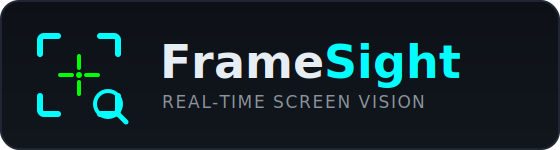
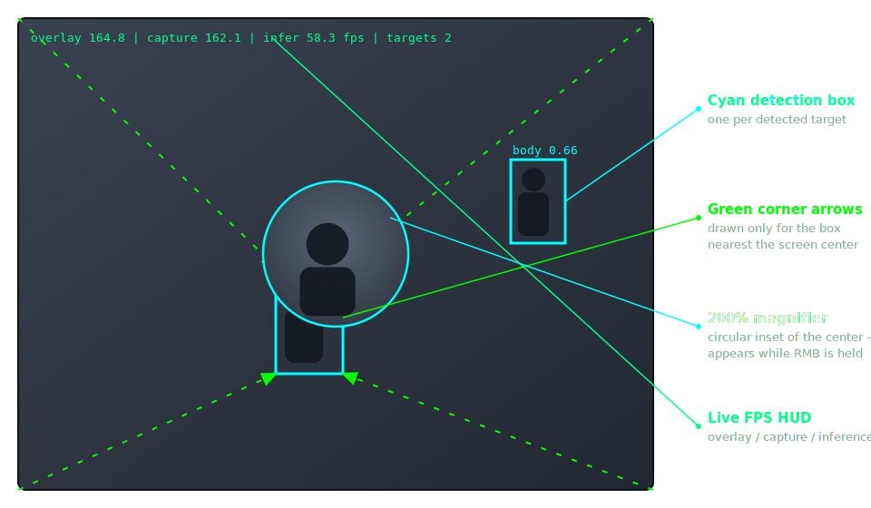

<p align="center">
  
</p>

<p align="center">
  <b>Real-time screen vision for Windows</b> — high-FPS capture, YOLO11n detection, and a transparent assistive overlay.
</p>

<p align="center">
  📖 <a href="https://jonahchang207.github.io/FrameSight/">Documentation</a> ·
  <a href="SETUP.md">Setup</a> ·
  <a href="TRAIN.md">Train</a> ·
  <a href="https://github.com/jonahchang207/FrameSight">GitHub</a>
</p>

---

FrameSight captures your display at up to **165 Hz**, runs **YOLO11n** on the GPU (CUDA, DirectML, or CPU), and draws a transparent, click-through overlay — built for accessibility research and visual assistance.

## Overlay at a glance

<p align="center">
  
</p>

> The image above is a labeled mockup of the overlay elements. To showcase a real run, drop a screenshot at `assets/screenshot.png` and it'll render below.
>
> <!--  -->

## Quick Start (no terminal)

If you just want to run FrameSight without touching a terminal:

1. **Clone or download** this repository.
2. **Double-click `Setup FrameSight.bat`** — a setup wizard opens, installs all dependencies into a local virtual environment, and detects your GPU automatically.
3. **Double-click `framesight_launcher.pyw`** anytime after that — a small status window appears with live FPS, an **OPEN HUD** button, and a **STOP** button. No terminal ever opens.
4. Click **OPEN HUD** (or go to `http://localhost:5000`) to adjust colors, magnifier size, line width, and more in real time.

> **Python 3.10+** must be installed first. Get it from [python.org](https://www.python.org/downloads/) and check *"Add python.exe to PATH"* during install.

---

## Features

- **High-FPS capture** — DXGI Desktop Duplication via `dxcam`, targeting your monitor's refresh (up to 165 Hz). The overlay sets `WDA_EXCLUDEFROMCAPTURE`, so it never captures itself.
- **GPU detection** — YOLO11n with automatic backend selection: CUDA (NVIDIA), DirectML + FP16 (AMD/Intel), or CPU. Forward/velocity model extrapolates boxes to paint time to hide inference latency.
- **Per-detection colors** — each detected target gets its own unique color from a 12-color palette, applied to the box, label, and lines simultaneously.
- **Center-to-corner lines** — dashed lines radiate from the screen center to all four corners of every detection box, one color per target.
- **Magnifier** — a circular zoomed inset of the screen center that appears **while you hold the right mouse button**. Runs on its own worker thread so box rendering is never blocked.
- **Live HUD panel** — browser-based control panel at `http://localhost:5000`. Adjust box thickness, colors, magnifier, proximity flash, and more without restarting.
- **Per-class toggles** — disable a class entirely (e.g. `detect_head: false`) so it's never inferred or drawn.
- **FPS overlay** — overlay / capture / inference FPS and target count drawn on screen.

## Requirements

- **Windows 10 (2004+) / 11** — the capture and overlay are Windows-only.
- **Python 3.10+**
- A GPU is recommended (NVIDIA CUDA, or AMD/Intel via DirectML). CPU works but is slower.

## Install (terminal / developer)

```powershell
git clone https://github.com/jonahchang207/FrameSight.git
cd FrameSight
.\scripts\setup_windows.ps1   # creates .venv and installs requirements
```

This installs the core dependencies (`ultralytics`, `opencv-python-headless`, `numpy`, `dxcam`, `Pillow`) plus the DirectML ONNX Runtime on Windows. See **[SETUP.md](SETUP.md)** for Python, dataset, and dependency details.

## Run (terminal / developer)

```powershell
.\scripts\train.ps1   # train weights (or place your own at weights/best.pt)
.\scripts\run.ps1     # launch the live overlay
```

`run.ps1` activates the venv and starts `python -m src.main`. Press **Ctrl+C** in the terminal to quit.

### Controls

| Action | Effect |
|--------|--------|
| **Hold right mouse button** | Show the magnifier at the screen center |
| **`http://localhost:5000`** | Open the HUD control panel in your browser |
| **Ctrl+C** (in terminal) | Quit FrameSight |

## Configuration

All settings live in **`config/default.yaml`** (copy to `config/local.yaml` to override without touching the default). Most settings can also be changed live via the HUD panel at `http://localhost:5000`. Highlights:

```yaml
capture:
  target_fps: 165
  region: [320, 180, 1280, 720]   # centered region; null = full monitor

model:
  weights: weights/best.pt
  conf: 0.7            # detection confidence threshold
  detect_head: false   # false = never detect or draw the 'head' class (body only)
  device: auto         # auto | cpu | 0 (CUDA) | dml

overlay:
  box_thickness: 2
  show_center_lines: true    # dashed lines from screen center to each box's corners
  center_line_width: 2
  proximity_flash: false     # red screen border when a target nears center
  magnifier: true            # circular zoom inset of the screen center
  magnifier_radius: 80       # on-screen radius of the magnifier circle (px)
  magnifier_zoom: 1.5        # magnification factor (1.5 = 150%)
  magnifier_hold_rmb: true   # only show the magnifier while RMB is held
```

## Documentation

| Guide | Description |
|-------|-------------|
| **[SETUP.md](SETUP.md)** | Install Python, dataset, and dependencies |
| **[TRAIN.md](TRAIN.md)** | Train the model and run the overlay |
| **[AUTODISTILL.md](AUTODISTILL.md)** | Label footage with AutoDistill → train in Colab |
| **[colab/FrameSight_Complete.ipynb](colab/FrameSight_Complete.ipynb)** | Full Colab notebook (upload → train → download → overlay) |

Full feature overview and pipeline details: **[jonahchang207.github.io/FrameSight](https://jonahchang207.github.io/FrameSight/)**

## Ethics

FrameSight is for **research and assistive technology** only. Many applications restrict third-party overlays — verify terms of service and use offline or permitted environments for development.
